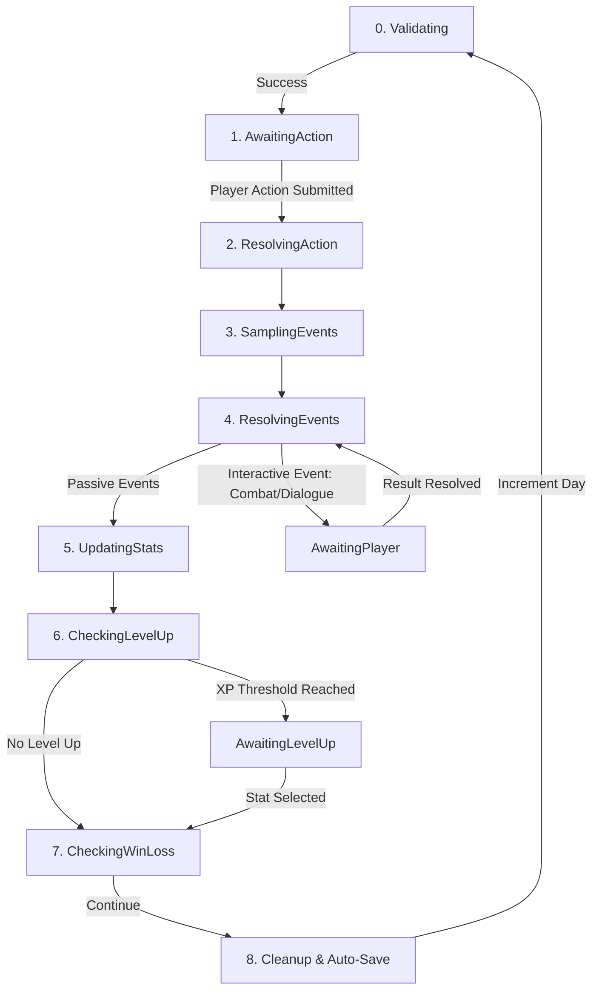

# 100 Days to Save the World — Game Architecture

This document provides a high-level architectural overview of **100 Days to Save the World**, a mobile resource-management RPG built using React Native, Expo, and TypeScript. It is designed to help developers and AI agents quickly understand how the game's systems interact without having to dive deep into the source code.

---

## 1. Game Overview & Core Goals

* **Timeline:** The player has exactly **100 days (turns)** to complete their journey.
* **Map & Travel:** The world consists of **125 linear locations** divided into distinct regions.
* **Victory Condition:** Reach location 125, survive the final boss battle (Roachak), and keep the player's health above zero.
* **Loss Conditions:**
  * Player Health reaches `0` (combat/event death).
  * Day number exceeds `100` before defeating Roachak.
  * Defeat in any mandatory boss fight (bridge bosses at locations 32, 65, 93, 125).
* **Resource Management:** The player must manage:
  * **Food:** Consumed each turn by the player and recruited companions. Zero food causes starvation and companion loyalty decay.
  * **Gold:** Used to purchase items, trade, or recruit/hire help.
  * **Morale:** Degrades over time. Morale tiers affect food consumption multipliers and combat power modifiers. Low morale risks companion desertion.
  * **Reputation:** Affects companion loyalty shifts and unlocks specific dialogue paths.
  * **Companions:** Up to a maximum party size. They provide passive bonuses, add combat power, but consume food every turn.

---

## 2. Directory Structure

The project code is divided into `app/` (Expo Router entry points and navigation shell) and `src/` (core application code).

```
├── app/                      # Expo Router Entry Points & Navigation
│   ├── _layout.tsx           # Root app wrapper (fonts, safe area, settings)
│   ├── index.tsx             # Main menu / Title screen
│   └── game.tsx              # Game shell (nav tabs, overlays, and modal manager)
│
├── docs/                     # Documentation folder
│   └── ARCHITECTURE.md       # This document
│
└── src/                      # Application Source Code
    ├── components/           # Shared UI components (StatusBar, JourneyBar, modals)
    ├── data/                 # Game databases
    │   ├── locations.ts      # 125 location definitions, regions, and shop rosters
    │   └── companions.ts     # The 11 recruit-able companion structures
    ├── engine/               # Game engines & mechanics (pure TS)
    │   ├── CombatEngine.ts   # Round-by-round combat resolution
    │   ├── DialogueEngine.ts # Branching narrative trees and conditions
    │   ├── EventSystem.ts    # Event sampler and passive outcomes
    │   ├── GameState.ts      # State generation, level-up choices, math helpers
    │   ├── ItemSystem.ts     # Inventory CRUD, equipment slots, effects
    │   ├── SaveEngine.ts     # AsyncStorage helper and database schema migrations
    │   ├── SoundEngine.ts    # Scaffolded audio managers
    │   ├── TurnEngine.ts     # The 10-phase game turn lifecycle manager
    │   └── types.ts          # Centralized TypeScript types & interfaces
    ├── store/                # Zustand State Stores
    │   └── gameStore.ts      # GameState store and hook selectors
    └── utils/                # Utility modules & helpers
```

---

## 3. Core State & Data Models

All shared models are defined in [types.ts](file:///D:/source/repos/hundred-days/src/engine/types.ts). 

### Master State: `GameState`
The entire application state is stored as a single flat/nested object within the Zustand store:
* **Core Info:** `runId`, `seed`, `rngState`, `dayNumber`, `currentLocationId`, `isComplete`, `outcome`.
* **Player State (`player`):** `level`, `xp`, current `health`, basic stats (`maxHealth`, `attack`, `defense`, `speed`, `endurance`, `perception`, `leadership`), and active `statusEffects` array.
* **Resources (`resources`):** `food`, `gold`, `items` (array of `InventoryItem` representing quantity and equipment status), `maxSlots` (inventory capacity), and `equippedItems` (slot-to-item definition mapping).
* **Morale (`morale`) & Reputation (`reputation`):** Numerical values, active tiers, and flag states (like `dreadActive`, `renown`, `notoriety`).
* **Companions (`companions`):** Array of active companion instances, tracking levels, loyalty values, and custom modifiers.
* **Event Tracking:** Sets containing historical data: `firedEventIds`, `visitedLocationIds`, `clearedCombatLocations`, `storyFlags`.
* **Turn Context (`currentTurn`):** Holds the active [TurnState](file:///D:/source/repos/hundred-days/src/engine/types.ts#L403) detailing the current phase, queue of sampled events, pending resource deltas, active interactive event, and turn log.

---

## 4. State Management & Persistence

### Store Configuration
The global state resides in [gameStore.ts](file:///D:/source/repos/hundred-days/src/store/gameStore.ts). To prevent unnecessary UI re-renders, components should subscribe to specific slices using the exposed hook selectors:
* `useDay()`, `useLocation()`, `useResources()`, `useMorale()`, `useReputation()`, `usePlayer()`, `useCompanions()`, `useWeather()`.

### Save & Load Loop (`SaveEngine.ts`)
* **Serialization:** Sets (`firedEventIds`, `visitedLocationIds`, etc.) are converted to arrays during serialization and restored as Sets when deserialized.
* **Save Triggers:** The save engine executes `saveRun()` at two primary points:
  1. At the end of every turn during the `TurnEngine.cleanup()` phase.
  2. Following any manual inventory adjustment (e.g., equipping, consuming, or selling items) in the Inventory screen.
* **Migrations:** Database structure updates are handled via versioned migration paths defined in `SaveEngine.migrate()`. The `SCHEMA_VERSION` (stored in `GameState.ts`) is incremented when state structures change.

---

## 5. The Turn Lifecycle (`TurnEngine.ts`)

The entire gameplay loop is orchestrated by `TurnEngine` using a **10-phase turn lifecycle** (defined by the `TurnPhase` enum).



### Turn Phases Detail

1. **Validating (`TurnPhase.Validating`):** Verifies if the player has expired the day limit or lost all health. If so, invokes game-over sequences.
2. **AwaitingAction (`TurnPhase.AwaitingAction`):** Pauses execution until the player chooses an action on the `RoadScreen`.
   * **Travel:** Advance to the next location. Triggers food cost and weather checks. Optional "Forced March" allows travel during severe weather but doubles food costs.
   * **Forage/Hunt:** Search for food in the current region. Endured by player speed and endurance.
   * **Rest:** Recover health and morale. Standard rest is free; resting at an Inn costs gold but doubles recovery.
   * **Trade:** Open merchant shop interface.
   * **Rally:** Raise morale or target a companion to boost loyalty (costs gold or food).
   * **Camp:** Make camp, consuming standard food.
3. **ResolvingAction (`TurnPhase.ResolvingAction`):** Calculates direct resource/stat adjustments resulting from the player's choice.
4. **SamplingEvents (`TurnPhase.SamplingEvents`):** Queries the `EventSystem` to check which random events have their conditions met, samples one or more, and queues them.
5. **ResolvingEvents (`TurnPhase.ResolvingEvents`):** Resolves the queued events sequentially.
   * **Passive Events:** Resolve instantly, applying stat adjustments immediately.
   * **Interactive Events (Combat/Dialogue):** Sets the phase to `AwaitingPlayer`, prompts the UI to open the corresponding screen, and waits. Once the player resolves the interface, `resolveInteractiveEvent()` is called, and execution loops back to complete the queue.
6. **UpdatingStats (`TurnPhase.UpdatingStats`):** Evaluates upkeep costs.
   * Subtracts food for player and companions (adjusted by morale multipliers).
   * Degrades morale (base loss + companion-related shifts).
   * Applies healing/regeneration effects from items or companion abilities.
   * Increments starvation counters if food is insufficient (penalizes morale and health).
   * Reduces durations on player `statusEffects`.
7. **CheckingLevelUp (`TurnPhase.CheckingLevelUp`):** Checks if the player's XP exceeds the current level threshold. If yes, transitions to `AwaitingLevelUp` and presents 3 random options from `LEVEL_UP_CHOICES`. Submitting choice routes back to the loop.
8. **CheckingWinLoss (`TurnPhase.CheckingWinLoss`):** Final check on game-over conditions or game victory (reaching loc 125 and defeating Roachak).
9. **Cleanup (`TurnPhase.Cleanup` / `TurnPhase.Complete`):** Consolidates all pending stat deltas, records the turn in history, triggers `SaveEngine.saveRun()`, increments `dayNumber`, and resets to `AwaitingAction`.

---

## 6. Key Systems

### Combat System (`CombatEngine.ts`)
Combat is a round-based interaction resolved within `CombatScreen.tsx` using a standalone `CombatEngine` instance.
* **Initiating Combat:** Can trigger via random event or manually when entering a location containing uncleared mobs.
* **Combatants:**
  * **Player:** Base stats + active equipment bonuses.
  * **Companions:** Add passive bonuses and join the battlefield with health and unique combat capabilities.
  * **Enemies:** Built from database templates, scaling in power based on how deep the player is in the map relative to their minimum location threshold.
* **Player Combat Actions:**
  * `Attack`: Deal physical damage to an enemy based on Player Attack and weapon modifiers.
  * `Defend`: Multiplies defense for the round.
  * `Skill`: Cast level-locked abilities.
  * `Flee`: Attempt to escape (check against speed differences).
  * `Negotiate`: Pay gold to end combat (disabled for bosses and certain monsters).
* **AI Actions:** Enemies target characters based on their designated behavior profile (`Aggressive`, `Opportunist`, `Pack`, etc.) and roll to execute special abilities (inflicting stun, stealing items, terrify).
* **Resolution:** Resolving combat produces a `CombatResult` summarizing XP, gold, food, health changes, and injuries. These are piped back to the `TurnEngine` via `resolveInteractiveEvent()` or `resolveLocationCombat()`.

### Dialogue & Story System (`DialogueEngine.ts`)
Manages character interactions, storyline paths, and recruiting companions via branching trees.
* **Dialogue Structure:** A conversation is composed of a `Dialogue` tree containing `DialogueNode` objects. Nodes define speaker info, body text, and an array of `DialogueChoice` options.
* **Branching & Choice Tones:** Choices are color-coded by tone (e.g., *Heroic*, *Pragmatic*, *Intimidating*, *Villainous*). Selecting a choice triggers an `outcome` that can jump to another node, modify resources/reputation, set global story flags, trigger combat, or recruit/dismiss a companion.
* **Dialogue Conditions:** Choices or nodes can be hidden/revealed based on player level, active companions, current location, reputation limits, or story flags.

### Event System (`EventSystem.ts`)
Manages the distribution of random occurrences.
* **Event Structure:** Defined by `GameEvent` schema containing condition queries (weather, location, day range, required status effects) and probability weightings.
* **Deduplication:** One-shot events are appended to `firedEventIds` to prevent repeating.
* **Resolution Types:**
  * `Passive`: Triggers immediate `passiveOutcome` effects (narrative string and stat/resource deltas).
  * `Interactive`: Points to a handler ID (e.g. `'combat_handler'` or `'dialogue_handler'`) to hand off control to the combat/dialogue sub-engines.

### Item & Inventory System (`ItemSystem.ts`)
Coordinates gear usage, stat boosts, and consumable effects.
* **Item Properties:** Item definitions track category (`Consumable`, `Weapon`, `Armor`, `Gear`, `Trinket`), stack limits, rarity, value, active effects (health restore, status removal), and passive effects (stat increments, weather protection, cost reductions).
* **Equipment Slots:** The player has slot boundaries: `Hand`, `Body`, `Back`, `Neck`, `Finger`. Only one item definition ID can occupy a slot.
* **Inventory Capacity:** Controlled by `resources.maxSlots` (base 8 slots, expanded to 10 by holding specific gear like the *Traveler's Pack*).
* **Application:** At the start of combat and turn cleanup, `computeEquippedBonuses()` scans active equipment to apply passive modifiers to player stats and costs.

### Companion System (`companions.ts`)
Companions are distinct characters that can join the party via recruitment events or dialogue.
* **Stats:** Companions possess level, XP, combat power rating, and food consumption rates.
* **Loyalty:** Shifts each turn based on player actions (rallying increases loyalty, starvation decreases it). High loyalty boosts their combat attributes; low loyalty causes complaints or desertion.
* **Archetypes:** Each companion has an archetype (`Warrior`, `Scout`, `Healer`, etc.) and a preferred reputation range. Staying outside this range causes a penalty to loyalty.

---

## 7. UI & Layout Architecture

The game utilizes a **Mobile-First Layout** optimized for fixed-viewport rendering, avoiding flex-overflow issues.

* **Navigation Shell (`app/game.tsx`):**
  * Houses the master navigation tabs bar at the bottom.
  * Embeds the persistent **Top Chrome**:
    * `StatusBar`: Renders player health, level, active status effects, food, gold, morale, and reputation tiers.
    * `JourneyBar`: A linear progress line tracking location travel relative to the final destination (location 125) and showcasing visual cues for boss regions and talk opportunities.
  * Orchestrates full-screen overlay modals:
    * `LevelUpModal`: Renders choice cards.
    * `JournalModal`: Displays historical log entries.
    * `SettingsModal`: Customizes settings (text speed, volume, actions confirmation).
    * `CombatAlertModal`: Alert prompting entry into combat.
    * `ShopScreen`: Overlay shop for merchant locations.
* **Screen Components (Main Area):**
  * `RoadScreen.tsx`: The primary game loop view. Uses a scroll view for logs, journal entries, and local flavor text, paired with action panels at the bottom.
  * `CombatScreen.tsx`: Grid layout mapping player, companions, and scaled enemy sprites, complete with custom action wheels, hit points meters, and log feeds.
  * `DialogueScreen.tsx`: Renders speaker speech bubbles and a vertical stacked menu of tone-coded choices.
  * `InventoryScreen.tsx`: 3-tab layout (Consumables, Equipment, Valuables) displaying item info cards and action triggers.
  * `MapScreen.tsx`: Scrollable visual representation of regions and location milestones.

---

## 8. Randomness & Seed Design (`Random.ts`)

The game uses a deterministic pseudo-random number generator (PRNG) to handle procedural elements:

* **Mulberry32 Engine:** Implemented in [Random.ts](file:///D:/source/repos/hundred-days/src/engine/Random.ts) as `nextMulberry32(state)`. It takes an integer state and returns a floating-point value between `0.0` and `1.0` and the next state integer.
* **RNG State Sync:** The active `rngState` resides in `GameState.rngState`. When the engine rolls, it updates this value to maintain consistency across saves/restores.
* **Run Layout Generation:** A separate deterministic pass is run at start-up using the main run seed. This ensures structural placements (e.g., elite spawns, path shortcuts, shop placements) are locked for a given run, whereas combat rolls and weather transitions consume the live `rngState`.
