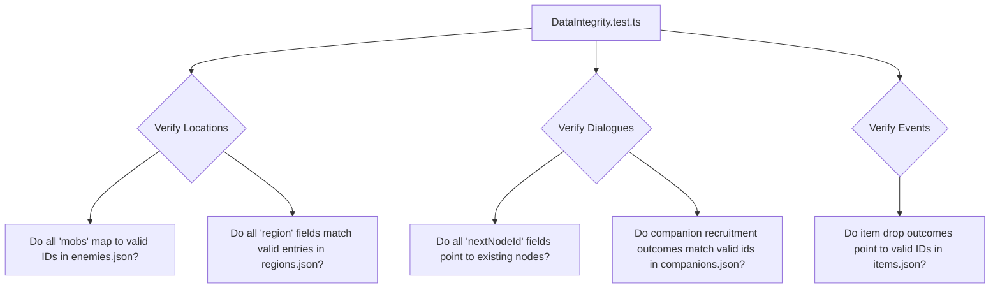

# Plan: Game Refactoring and JSON Migration (PLAN3.md)

This document outlines the architecture and implementation plan for a comprehensive refactoring of **100 Days to Save the World**. The two primary goals are:
1. **Separation of Concerns:** Moving static game database definitions from TypeScript code into JSON configuration files.
2. **Refactoring Subsystems:** Improving gameplay, performance, UI responsiveness, and memory efficiency across the travel, combat, items, mobs, companions, randomness, and UI systems.

---

## 1. JSON Data Migration Architecture

Currently, data and logic are coupled in several TypeScript files. Moving static arrays to JSON prevents typescript bundle bloat, reduces memory consumption, separates content design from engine execution, and speeds up hot-reloading during development.

### Proposed Database Layout

```
src/data/
├── locations.json           # 125 location nodes, including shops and local mob configurations
├── regions.json             # 9 region boundaries, descriptions, and danger levels
├── companions.json          # Companion base stats, passive/active bonuses, narratives
├── items.json               # Weapons, armors, consumables, trinkets, price, active/passive effects
├── enemies.json             # Enemy stats, combat behavior profiles, ability tables (including bosses)
├── events.json              # Random events, weather changes, conditions, passive deltas
├── dialogues.json           # Narrative trees, options, conditions, choice outcome deltas
└── config.json              # XP thresholds, general configuration, multipliers, thresholds
```

---

## 2. JSON Schemas and TS Integration

To maintain type safety while loading JSON data at runtime, we will utilize TypeScript's native JSON importing capability (which is supported out of the box in Expo's tsconfig).

### TypeScript Integration Pattern
Each data module will import its respective JSON file and assert the appropriate type from [types.ts](file:///D:/source/repos/hundred-days/src/engine/types.ts). For example:

```typescript
// src/data/locations.ts
import locationsJson from './locations.json';
import regionsJson from './regions.json';
import { Location, RegionDefinition } from '@engine/types';

export const LOCATIONS = locationsJson as Location[];
export const REGIONS = regionsJson as RegionDefinition[];

// Helper logic stays pure and decoupled
export function getLocation(id: number): Location {
  return LOCATIONS.find(l => l.id === id) ?? DEFAULT_LOCATION;
}
```

### 1. Locations Schema (`locations.json`)
```json
[
  {
    "id": 1,
    "name": "Okuna",
    "type": "town",
    "region": "Senin Valley",
    "isTown": true,
    "hasShop": true,
    "mobs": [
      { "enemyId": "small_rats", "aggroPct": 0 }
    ],
    "actions": {
      "canSteal": true,
      "huntYield": null,
      "restQuality": 1.0,
      "travelDifficulty": 1,
      "hasBossFight": false
    },
    "bossLevel": null,
    "locationText": "The ancient port city of Okuna is quiet. The journey begins.",
    "randomTexts": [
      "Smell of brine hangs over the docks.",
      "Locals whisper of dark clouds in the east."
    ]
  }
]
```
> [!IMPORTANT]
> Change `mobs` in the schema from carrying a loose `name` to carrying `enemyId`, resolving string-matching hazards in `CombatEngine.buildEnemiesForLocation`.

### 2. Regions Schema (`regions.json`)
```json
[
  {
    "name": "Senin Valley",
    "locationRange": [1, 9],
    "description": "Safe, agricultural valleys.",
    "dangerLevel": 1
  }
]
```

### 3. Companions Schema (`companions.json`)
```json
[
  {
    "id": "rex_the_dog",
    "name": "Rex the Dog",
    "archetype": "animal",
    "description": "A scrappy brown dog.",
    "portraitId": "portrait_rex",
    "level": { "current": 1, "xp": 0, "xpToNext": 20 },
    "loyalty": { "value": 80, "desertsBelow": 10, "complainsBelow": 30 },
    "passiveBonus": {
      "luckModifier": 0.03,
      "foragingBonus": 1,
      "moralePerTurn": 1
    },
    "foodCostPerTurn": 0.5,
    "combatPower": 8,
    "loyaltyGains": { "onMoraleHigh": 2, "onReputationMatch": 0, "onRally": 1, "onCombatVictory": 3 },
    "loyaltyLosses": { "onStarvation": 8, "onMoraleLow": 1, "onReputationMismatch": 0, "onBrokenPromise": 5 },
    "preferredReputation": null,
    "recruitRequirements": {},
    "recruitNarrative": "Rex leaps forward...",
    "departureNarrative": "Rex stops..."
  }
]
```

### 4. Items Schema (`items.json`)
```json
[
  {
    "id": "healing_potion",
    "name": "Healing Potion",
    "description": "Restores 25 health immediately.",
    "category": "consumable",
    "slot": "none",
    "activeEffect": { "healthRestore": 25 },
    "isConsumable": true,
    "shopPrice": 20,
    "foundInRegions": ["Qanisi Territory", "Eastern Wilds"],
    "maxStack": 3,
    "iconId": "potion_red",
    "rarity": "uncommon"
  }
]
```

### 5. Enemies Schema (`enemies.json`)
```json
[
  {
    "id": "small_rats",
    "name": "Small Rats",
    "description": "A skittering swarm.",
    "baseHP": 8,
    "baseAttack": 3,
    "baseDefense": 1,
    "baseSpeed": 6,
    "behavior": "pack",
    "minLocationId": 1,
    "scaling": 1.0,
    "abilities": [
      { "id": "swarm", "name": "Swarm", "probability": 0.3, "damageMultiplier": 1.2, "specialEffect": "stun" }
    ],
    "immuneToNegotiate": true,
    "physicalResistance": 0.0,
    "moraleDamageOnSight": 0,
    "xpReward": 5,
    "goldReward": 0,
    "foodReward": 0,
    "encounterText": ["A swarm of rats boils up..."],
    "defeatText": "The rats scatter...",
    "victoryText": "You've been overwhelmed..."
  }
]
```

### 6. Events Schema (`events.json`)
```json
[
  {
    "id": "weather_storm_rolls_in",
    "type": "weather_change",
    "resolutionType": "passive",
    "name": "Storm Rolls In",
    "description": "Dark clouds gather...",
    "conditions": {
      "probability": 0.15,
      "forbiddenStatusEffects": ["in_storm"]
    },
    "passiveOutcome": {
      "weatherOverride": "severe",
      "statusEffectsAdded": ["in_storm"],
      "narrativeText": "The storm settles in."
    },
    "repeatable": true,
    "tags": ["weather", "danger"]
  }
]
```

### 7. Dialogue Trees Schema (`dialogues.json`)
Dialogues can be combined into a single file or parsed as an array of trees:
```json
[
  {
    "id": "rex_the_dog",
    "title": "Rex Wants to Come",
    "triggerType": "location_enter",
    "triggerConditions": { "locationIds": [2, 3, 4], "notAlreadyMet": true, "forbiddenCompanionId": "rex_the_dog" },
    "rootNodeId": "rex_01",
    "repeatable": false,
    "tags": ["companion", "early_game"],
    "nodes": {
      "rex_01": {
        "id": "rex_01",
        "speakerName": "Narrator",
        "text": "A scruffy brown dog follows you...",
        "choices": [
          {
            "id": "rex_take",
            "text": "\"Alright. Come on then.\"",
            "tone": "heroic",
            "outcome": {
              "nextNodeId": "rex_joins",
              "moraleDelta": 5,
              "companionEffect": { "type": "recruit", "companionId": "rex_the_dog" },
              "flagsSet": ["rex_recruited"]
            }
          }
        ]
      },
      "rex_joins": {
        "id": "rex_joins",
        "speakerName": "Narrator",
        "text": "Rex leaps forward...",
        "choices": [],
        "autoAdvance": true,
        "autoAdvanceToId": null
      }
    }
  }
]
```

### 8. Config Constants Schema (`config.json`)
```json
{
  "XP_THRESHOLDS": [0, 30, 75, 140, 230, 350, 500, 680, 900, 1200],
  "BOSS_POWER_THRESHOLD": 180,
  "BOSS_POWER_IDEAL": 240,
  "MORALE_FOOD_MULTIPLIERS": {
    "inspired": 0.8,
    "steady": 1.0,
    "weary": 1.2,
    "desperate": 1.5,
    "broken": 2.0
  }
}
```

---

## 3. Data Integrity & Verification Testing

To prevent data drift and link breakage, we will create a dedicated Jest test suite `src/__tests__/unit/DataIntegrity.test.ts`. This test suite parses the JSON files directly and checks references:



---

## 4. Gameplay & Code Refactoring Proposals

### A. Travel Subsystem Refactoring
* **Problem:** `TurnEngine.resolveMove()` (approx. 150 lines) is a monolithic, highly nested method carrying calculations for cloaks, food costs, starvation, forced marching, speed, and luck rolls.
* **Refactor Plan:** Extract calculations into dedicated pure functions in a new `src/engine/helpers/TravelCalculator.ts`:
  * `calculateTravelFoodCost(state, options)`: Returns base food consumption.
  * `determineTravelDistance(state, options)`: Resolves luck calculations and weather constraints.
  * `resolveTravelOutcomes()`: Orchestrates the phase transitions and state ticks.
* **Data-driven regions:** Shift weather thresholds and danger factors into `regions.json` instead of hardcoding weather modifiers inside `resolveMove`.

### B. Combat Subsystem Refactoring
* **Problem:** In `CombatScreen.tsx`, components suffer from rendering lag if state calculations run directly within render loops, particularly during typewriter logging.
* **Refactor Plan:** 
  1. Standardize enemies mapping by using strict `enemyId` mapping inside location mob pools rather than loose string matching.
  2. Implement local UI caching for combat logs and damage numbers.
  3. Ensure that when starting combat, `CombatEngine` reads templates safely from `enemies.json` and updates the active `combatState` in a single atomic Zustand update.

### C. Equipment & Items Subsystem Refactoring
* **Problem:** Item effects are hand-checked with custom logic scattered inside `TurnEngine.ts` and `CombatEngine.ts`.
* **Refactor Plan:** Standardize active and passive effect configurations. Write helper loops to scan equipped item arrays dynamically:
  ```typescript
  export function sumEquippedModifiers<K extends keyof ItemPassiveEffect>(
    equipped: ItemPassiveEffect[],
    key: K
  ): number {
    return equipped.reduce((sum, item) => sum + ((item[key] as number) ?? 0), 0);
  }
  ```
  This reduces complex `if/else` checks for specific items in core game engines.

### D. NPCs & Companions Subsystem Refactoring
* **Problem:** Reputation constraints for recruitment were duplicate-checked in both `companions.ts` and dialogue outcomes.
* **Refactor Plan:** Consolidate requirements directly into the companion's JSON schema (under `recruitRequirements`). Ensure `isReputationInCompanionRange` inside `TurnEngine.ts` checks this schema dynamically.

### E. Dialogue story flag persistence
* **Problem:** A module-level placeholder Set was historically noted, which could lose story states on application reset.
* **Refactor Plan:** Complete integration of the `storyFlags` Set inside `GameState`. During load and serialization, ensure dialogue history flags are serialized as string arrays and deserialized as `Set` objects to guarantee full persistence across saves.

---

## 5. UI & Layout Optimizations

### Prop-Drilling vs. Selectors
* **Problem:** `app/game.tsx` subscribes to the global `gameState` object. Any state change (even a single food unit update) triggers a complete re-render of the shell, the `StatusBar`, and the `JourneyBar`.
* **Refactor Plan:**
  * Utilize Zustand selector hooks (`useDay()`, `useLocation()`, `useResources()`, etc.) directly inside leaf components (`StatusBar.tsx`, `JourneyBar.tsx`) instead of passing the entire `gameState` object as a prop.
  * Wrap list components (like items in `InventoryScreen` or region logs in `MapScreen`) in `React.memo` to prevent child re-renders.

### Layout Resilience
* **Problem:** Minor styling inconsistencies and viewport clipping on smaller phone screens.
* **Refactor Plan:**
  * Enforce CSS-like React Native `StyleSheet` styling using centralized color tokens (`Colors.parchment`, `Colors.ink`, etc.) imported from `src/theme.ts`.
  * Ensure keyboard-safe viewports in modal popups by using `KeyboardAvoidingView` to prevent buttons from being pushed off-screen.

---

## 6. Implementation Checklist & Verification

```
[ ] Step 1: Create JSON data files in src/data/ and verify schemas.
[ ] Step 2: Enable/Verify resolveJsonModule in tsconfig.json.
[ ] Step 3: Write src/__tests__/unit/DataIntegrity.test.ts to validate JSON content.
[ ] Step 4: Refactor src/data/locations.ts, src/data/companions.ts, and src/engine/ItemSystem.ts to load from JSON.
[ ] Step 5: Refactor CombatEngine.ts (enemies roster) and DialogueEngine.ts (dialogues tree) to load from JSON.
[ ] Step 6: Refactor TurnEngine.resolveMove into modular sub-calculators.
[ ] Step 7: Transition StatusBar.tsx and JourneyBar.tsx to use slice selectors.
[ ] Step 8: Run npm test and verify all 284+ test suites pass without regressions.
```
